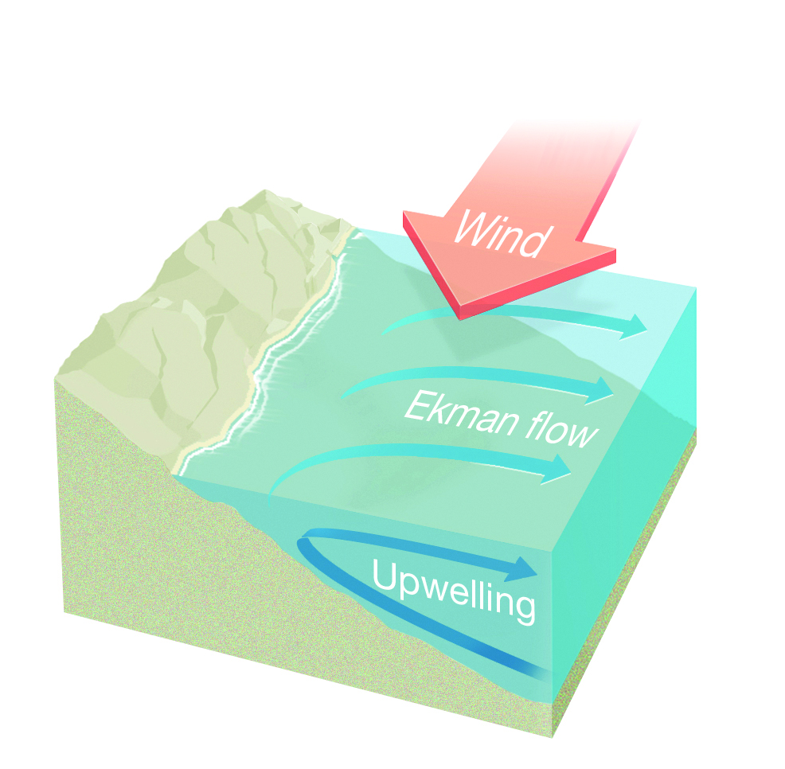

Ekman cluster documentation
===========================

A picture of Ekman cluster.

**Ekman** was launched in exteneded new architecture in September 2024.

This new infrastructure consists of additional nodes and an upgraded software stack.
Ekman works under a job scheduler, **SLURM** (Simple Linux Utility for Resource Management). 

Official cluster documentation: https://sail.ocean.ru/comcen/ekman_ru.html.

After the upgrade, the old nodes are incorporated into the new in partitions:
 
**broadwellr2**, **r2c2**, **rack1**, **knl** and **gpu**.

Latest update: |release_date|.

.. |release_date| replace:: July 2025

.. _computer: https://en.wikipedia.org/wiki/Computer_hardware
.. _Bash: https://en.wikipedia.org/wiki/Bash_(Unix_shell)

.. toctree::
   :maxdepth: 3
   :caption: Contents:

   cluster-basics
   specs
   

*This is an evolving guide. More sections coming soon.*
